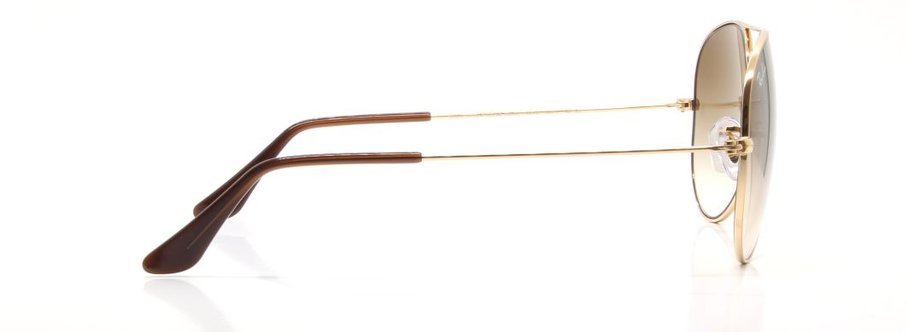

# jQuery based image magnifier
Original by MonsterDuang
Updated and edited by IDEDOnline for SureSpecs
(There is almost none of the original left in my version so to upgrade please completely remove the original script and html, then install this one)

#### Instructions
You need to include jQuery and Bootstrap 3+ in your html to make this function

Include the following scripts.
<script src="scripts/zoom-image.js"></script>
<script src="scripts/zoom-image-main.js"></script>

Include the following css file, edit this to fit your sites styles.
<link rel="stylesheet" href="css/image-zoom-main.css">

Inset the following html into your page within the container you want the zoom carousel to appear.

```
//Copy after here
<div class="img-zoom-container col-xs-12" data-lrgwidth="4250" data-lrgheight="1560" >
  <div class="show">
	
    
	<div class="img-zoom-cover"></div>
	<a class="visible-xs visible-sm" id="img-zoom-mobileView" onclick="mobileZoom();" style="position:absolute;top:0;bottom:0;left:0;right:0;z-index:10;"></a>
  </div>
  <div class="small-img">
    
    <div class="small-container">
      <div id="small-img-roll">
        
        
        
        
      </div>
    </div>
    
  </div>
</div>
</div>
<div id="img-zoom-mobileViewer">
	<p style="font-size: 3em;height:5vh;">Press and drag to move</p>
	<div class="img-zoom-mobileViewContainer">
		
	</div>
	<a style="font-size: 3em;" onclick="mobileZoomClose();" id="img-zoom-mobileViewerClose">Close</a>
</div>
//End of copy here
```

You will need to alter the following lines in the html to fit your configuration:
<div class="img-zoom-container col-xs-12" data-lrgwidth="4250" data-lrgheight="1560" >

data-lrgwidth="4250" - should be the width of the zoomed image this will be used to calculate the images position in accordance with mouse location.
data-lrgheight="1560" - should be the height of the zoomed image this will be used to calculate the images position in accordance with mouse location.

Then within the small-img-roll element you need to add your thumbnails in the following format 
```
<div id="small-img-roll">
	
	
	
	
</div>
```
Note the data-hres attribute this will need to be set for each thumbnail to point to the zoom version and these should all be uniform with the previously
set dimensions you can have one or more thumbnails the system should be able to support any amount.

That's it your done open your page in a web browser on mobile or desktop device to see the differences but this should work and be nice and ui friendly in either.

#### To-do list
- [x] Change code to be compatible with Bootstrap 3.
- [x] Change code to use multiple image files (one for normal view and one for magnified version).
- [x] Add handling for responsive design.
- [x] Add mobile view to replace limited viewing box on mobile devices.
- [x] Make thumbnail handling more dynamic to auto support more or less images (allow feed for db list).
- [x] Make thumbnail handling more dynamic support thumbnail sizes in a non-hardcoded manner (multiple image of same size but don’t require a new js build for each page featuring slider if it has a set of image different from other pages).
- [x] Separate out styling from code to allow restyling without require for rebuild of script.
- [ ] Fix issue with responsive design creating browser lag when window resized manually (fix for unbind-rebind method currently implemented to handle new scaling).
- [ ] Fix issue with image scale calculation and mouse position (magnified layer doesn’t match exact position of normal layer during magnification).
- [ ] Investigate and fix issue in Safari meaning magnified layer is not displayed correctly (height reduced to small line).